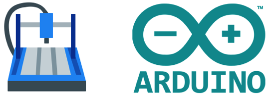

# Wood CNC Mill

## Make & model

[  
Carbid3D Shapeoko CNC](https://carbide3d.com/shapeoko/)

- [GRBL Controller](https://docs.carbide3d.com/shapeoko-faq/controller-firmware-information/)
- [T-Track and Clamp Modification](https://shop.carbide3d.com/collections/accessories/products/t-track-table?variant=5175720706078)
- [Z-Plus Upgrade](https://shop.carbide3d.com/collections/accessories/products/shapeoko-z-plus?variant=31524471144509)

Size:

- 30in x 30in bed (762 mm x 762mm)
- Max material thickness: 2.5″ (63.5mm)
- Max cut thickness: up to 2.5″(63.5mm), varies by router bit

What it can do: 

- Subtractive manufacturing
- Engraving
- Sign making
- Furniture prototyping

## Materials

### Allowed

- Wood: MDF, plywood, regular wood
- Polycarbonate (with special bit)

### Disallowed Materials

- Metal
- glass

## Usage Rules

Certification: [Vectric VCarve Pro design class](https://seattlemakers.org/catalog#vcarve) and [CNC-Mill machine certification](https://seattlemakers.org/catalog#CNCcert) are both required in order to use the machine solo.  
File type: .svg, .dxf

## Pricing

Time on this machine will be charged in 30-minute increments. [Buy time](https://seattlemakers.org/store/items/machine-time/) and [schedule time](https://seattlemakers.org/schedule/) on the Seattle Makers website.

## Designing and Milling your project

Seattle Makers uses [Vectric's VCarve Pro](https://www.vectric.com/products/vcarve-pro) for designing and generating the g-code for you project 

> Note: VCarve only runs on Windows.

> NOTE: You will be able use the Trial version of VCarve indefinitely for your designs when you have completed the certification.

[CNCJS](https://cnc.js.org/) is used for controlling the Shapeoko based on the g-code created in VCarve.

### Bits

There are 1/4" End Mills and 1/2" 90 Degree V-Bits for general use at Seattle Makers.

For higher quality cuts and speciality bits, [McMaster-Carr is a great sours of router bits](https://www.mcmaster.com/standard-router-tools).

> Note: The Shapeoko will accept 1/4" or 1/8" shank bits.

## Additional Resources

**Software**
- [Vectric VCarve Pro ](https://www.vectric.com/products/vcarve-pro) Product Site
- [Vectric's YouTube Channel](https://www.youtube.com/user/Vectric)
- [CNCJS](https://cnc.js.org/) Project Site 
- [CNCJS Documentation](https://cnc.js.org/docs/)
- [Demonstration of different router bits](https://www.youtube.com/watch?v=2FjXsZKrobQ)
