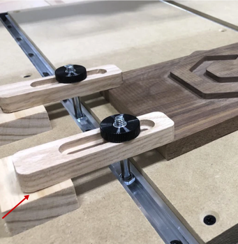

# Wood CNC Mill

## Make & model

  
[Carbide 3D Shapeoko CNC](https://carbide3d.com/shapeoko/)

- [GRBL Controller](https://docs.carbide3d.com/shapeoko-faq/controller-firmware-information/)
- [T-Track and Clamp Modification](https://shop.carbide3d.com/collections/accessories/products/t-track-table?variant=5175720706078)
- [Z-Plus Upgrade](https://shop.carbide3d.com/collections/accessories/products/shapeoko-z-plus?variant=31524471144509)
- [Dewalt 611 Router](https://wiki.shapeoko.com/index.php/DWP611)

Size Constraints:

- 30in x 30in bed (762 mm x 762mm)
- Max material thickness: 2.5″ (63.5mm)
- Max cut thickness: up to 2.5″(63.5mm), varies by router bit
- Router Bits: 1/4" and 1/8" shank bits supported

## Usage Rules

Certification: [Vectric VCarve Pro design class](https://seattlemakers.org/catalog#vcarve) and [CNC-Mill machine certification](https://seattlemakers.org/catalog#CNCcert) are both required in order to use the machine solo.

## Pricing

Time on this machine will be charged in 30-minute increments. [Buy time](https://seattlemakers.org/store/items/machine-time/) and [schedule time](https://seattlemakers.org/schedule/) on the Seattle Makers website.

## Materials

### Allowed

- Wood: MDF, plywood, regular wood
- Polycarbonate (with special bit)

### Disallowed Materials

- Metal
- glass

### Spoil Board

A spoil board is a sacrificial piece of wood placed under your workpiece. When you cut all the way through your workpiece you will cut into the spoil board.

The maker space has some small pieces of 1/4" MDF you can use for small projects, but if you are going to be doing lots of cuts or many projects, you should bring your own spoil board along with your workpiece.

## Designing and Milling your project

Seattle Makers uses [Vectric's VCarve Pro](https://www.vectric.com/products/vcarve-pro) for designing and generating the g-code for you project.

> Note: VCarve only runs on Windows.

> NOTE: You will be able use the Trial version of VCarve indefinitely for your designs when you have completed the certification.

[CNCJS](https://cnc.js.org/) is a browser-based interface used for controlling the Shapeoko based on the g-code created in VCarve. Run the CNCJS service from the command line and access the application from the web browser on the PC connected to the CNC. The [documentation for CNCJS](https://cnc.js.org/docs/) is a good resource.

### VCarve Designing

**Job Setup**
Assuming a Single Sided project or "Job Type" as it is called in VCarve:

- Configure your job Size dimensions: width (x axis), length (y axis) and your material thickness.
- Set Z Zero Position to be Material Surface
- Set Datum Position to be Material Surface  

**Draw your Project**

In your VCarve Class, you will learn how to make a basic design. We won't go into too much more about that here. See the Additional Resources for links to more tutorials, especially the Vectric YouTube channel. There are also handy tutorials in the VCarve Welcome screen.

**Toolpaths**

For each cut in your design, specify the bit (tool) and any other parameters for its cutting step.

**TODO**: Speeds & Feeds

**TODO**: Standard Shop Settings for 1/4" End mill and 1/2" 90 degree v-bit

**Ghost Cut Toolpath**

A ghost cut moves the router through the outer outline of your project so you can visually inspect that your cut will stay on your work piece and not hit any clamps. To create a ghost cut:

1. Make a duplicate of the toolpath which will cut the outline of your project by right clicking on the toolpath and selecting duplicate.
1. Rename the toolpath to so it starts with "Ghost".
1. Change the cut depth to 1 mm on the Ghost toolpath.
1. Calculate the toolpath and review in the preview.

**Saving Design & Toolpaths**

With the VCarve Maker Space Client Edition, you can save your design and toolpaths as a VCarve File (.crv, .crvt). Bring this file with you to the maker space where the fully licensed version of VCarve will allow you to export the project to to the G-Code which used to control the CNC.

> Note: Quite often, members setup their toolpaths in the maker space instead of at home where they may not know all the bit specific settings. You cannot export the G-Code at home, this requires the fully licensed version of VCarve.

## Safety

You will need:

1. Hearing protection
1. Eye protection
1. Dust protection

Let everyone in the wood shop know before you turn on the router so they can also put on hearing protection. Close the door to the wood shop as well.

When the router is running, you should be ready to PAUSE the CNC with the mouse, or turn off the CNC completely by using the switch with red tape on it. This means you're standing at the keyboard area.

## CNC Setup

1. Make sure the CNC is clear of everything not related to your project and clean of dust.
1. Clamp your spoil board and your workpiece to the machine bed.  
You should be able to push firmly on your workpiece and the machine (not your workpiece) should move first.
1. Install the first bit you will use in your project.
1. Zero the Bit
1. Setup the dust collection
1. Set the router spindle speed using the dial on the top\side of the router.

### Clamping Your Workpiece

> NOTE: Prior to clamping, mark the exact center of your work piece and place a small X there.

This image shows how you use the clamps provided. The blocks on the backside of your clamps should be a little taller than your workpiece.

### Router Bit Installation

If your project uses more than one bit, such as a v-bit for letting and an end mill for cutting out shapes, install the first bit you will use. 

>Note: You should always cut-out your project as the last step so your project remains firmly held in-place for all the other steps.

Install the bit so all of its cutting surface extends beyond the colette.
While pushing the lock button the router, tighten the bit firmly, careful to not over-tighten. "Wrist-strength" is the shop term, don't lean into it with your shoulder.

### Zero the Bit

**Machine Position Vs. Work Position**

The position of your cutting tool (X, Y, Z) can be referenced from the machine's home (the top-right corner) or from the origin you configure. Both the Machine Position and the Work Position are displayed in CNCJS.

**Moving the Gantry by Hand**

When the CNC is _off_, it is ok to _SLOWLY_ push the gantry around. _Slowly_ is key so as not to fry the motors or control boards.

If you can't push the gantry around, the CNC is on. *STOP* and turn off the CNC.

**X, Y Axis Zero**

Using the CNCJS program, move the bit using the X and Y controls to place the tip of the bit directly over the "X" you drew at the center of your work piece. When you are happy with the positioning, click the Zero Work Position for the X and Y axis in CNCJS. 

**Paper Zeroing the Z Axis**

Using the small shop note pad paper, place it over the "X" at the center of your piece. Using small steps, move the gantry down till your but _just_ catches the paper. Be careful not run you bit hard into the table. You want to creep-up on it at .1mm steps. when you are happy with the positioning, click the Zero Work Position for the Z axis in CNCJS.

### Dust Collection

Find the Festool Dust Collection vacuum and position it in front of the CNC. The arm will extend over the CNC and the hose attached to the dust collection boot on the router.

- The vacuum plugs into the wall.
- The extension cord to the router plugs into the Festool.
- The vacuum speed is set to "Rabbit" mode. 🐇
- The vacuum is set to automatic, which triggers the vacuum to run only when the router is on.

When you're not ready to run the CNC, keep the router unplugged from extension cord hanging above the CNC.

## Project Setup at the PC

1. Turn on the PC connected to the CNC.
1. Turn on the CNC.
1. Open a command prompt and run `cncjs`
1. Open Chrome and open the CNCJS Shortcut in the toolbar

1. In the web browser connect to the CNC on COM3
1. Click HOMING button to move the upper right most positions (-5,-5)

**Saving Toolpaths to G-Code**

In the maker space, open your VCarve file and setup all your toolpaths, including your Ghost toolpath if you have not already done so.

Save each of your toolpaths to bit-specific files, being sure to also save the Ghost toolpath to its own file.

**Ghost Cut**

Assuming you have your workpiece clamped, and you've zeroed the x, y, and Z axis you are ready to move to running the CNC. This first Ghost cut will be done with the router **off**.

- Move the Z axis up so it's above all clamps in your work area (+40mm for example) and set the Z-axis home by clicking the Zero Work Position for the Z axis in CNCJS.
- In CNCJS, open the ghost cut toolpath g-code file, review that it looks correct and is the outer most path of your project.
- Click Play and watch the router moving. It should not look like it, the dust shield or the gantry will hit anything.
- Make any corrections to your workpiece position, clamps, cord layout, X,Y home, etc.. until the Ghost cut looks good.
- When you are happy with the ghost cut, re-home the Z axis. Don't just lower it blindly (or quickly), use the paper technique again.

## Time to Cut

1. In CNCJS, open the g-code toolpath file for your first bit.
1. Review your work area to ensure it is clear, safe and ready to go.
1. Ask everyone to wear hearing protection in the workshop.
1. Plug in the router.
1. Turn on the router. You should also hear the vacuum come on. If not, stop and fix.
1. In CNCJS, click play.

While cutting: Be ready to PAUSE the CNC with the mouse, or turn off the CNC completely by using the switch with red tape on it.

When your cut is complete, turn off and unplug the router.
Change bits and run your next cut or move on to cleaning up if you are done.

## Cleaning up

- Use the Festool to vacuum up all the dust and chips in your work area.
- Return all the clamps and wedges to the CNC cart drawers.
- Shut down the CNC PC and turn off the monitor.

## VCarve Design Tips

**Tabs**

- If you're cutting through your material with this tool path, you need to add the through cut amount back to your tabs. For example: If your cutting to a depth of 15mm to cut all the way through your 12 mm material, you should add those 3mm back to your tabs. So a 9mm thick tab would actually be 6mm. 
- Use 3-D Tabs as a preferred setting.

**Profile Toolpaths**

- Enable Add Ramps to toolpaths to prevent burning of your material where the bit plunges repeatedly
- To leave some material for sanding or other finishing work, you can use the offset allowance in the Machine Vectors.
- When setting up a profile toolpath, also select "Separate Last Pass" to get a better final cut quality.
    - The last pass will remove your material allowance if you don't also have and allowance on the last pass as well.
    
**3-D or Toolpath Preview**

- If the preview doesn't look like you expect, click "Reset Preview" and then replay the preview.

**2D Toolpath alignment**

- Show your toolpaths and be sure they are properly lined up (on top of your drawing). If not re-calculate your toolpaths to align your toolpaths with any design changes you've made. In this example you can see the toolpath for "Door" is below where it should be. As opposed to the perfectly aligned toolpath for the circle below it.  

### Bits

There are 1/4" End Mills and 1/2" 90 Degree V-Bits (both with 1/4" shanks) for general use at Seattle Makers.

For higher quality cuts and specialty bits, [McMaster-Carr is a great sours of router bits](https://www.mcmaster.com/standard-router-tools).

> Note: The Dewalt 611 will only accept 1/4" or 1/8" shank bits.

## Additional Resources

**Articles, Books & Videos**

- Make: Design For CNC [Seattle Public Library](https://seattle.bibliocommons.com/item/show/3565923030) [Make: Shop](https://www.makershed.com/products/make-design-for-cnc)
- [Spiral Bits - Compression VS Upcut VS Downcut VS Straight](https://www.youtube.com/watch?v=seAmL6mtqgM)
- [50 Digital Wood Joints by Jochen Gros](http://winterdienst.info/50-digital-wood-joints-by-jochen-gros/)
    - [50 Digital Joints - Real Assembly Examples](https://www.youtube.com/watch?v=PzTpfLcL1Y8)

**Software**

- [Vectric VCarve Pro ](https://www.vectric.com/products/vcarve-pro) Product Site
- [Vectric's YouTube Channel](https://www.youtube.com/user/Vectric)
- [CNCJS](https://cnc.js.org/) Project Site 
- [CNCJS Documentation](https://cnc.js.org/docs/)

## Glossary

- **611**: The Dewalt 611 Router
- **611 Dial**: The router RPM setting dial on the Dewalt 611 Router
- **DOC**: Depth of Cut, how deep you are (or can) cut with a specific bit
- **Feed**: The speed of the bit in the X\Y axis 
- **Plunge**: The speed of the bit in the Z axis
- **RPM**: Revolutions per Minute of the router bit
- **X0Y0**: This CNCJS button moves the router to the X\Y work position home.
- **Z0**: This CNCJS button moves to the Z work position home.
