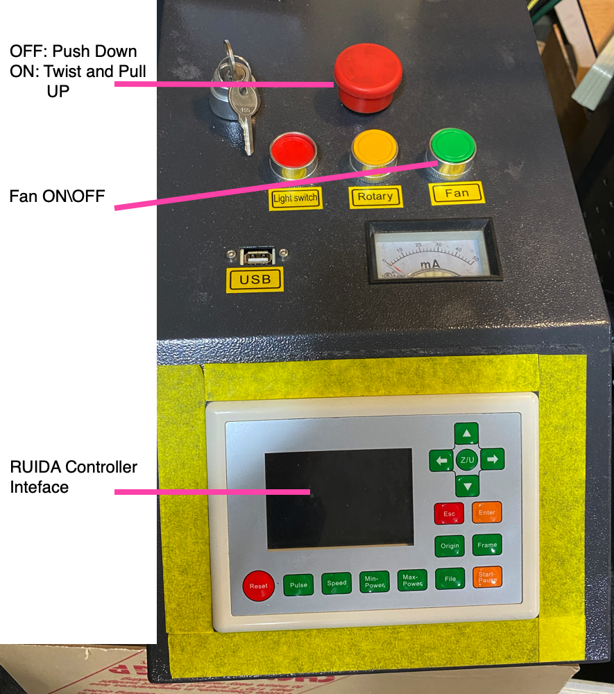
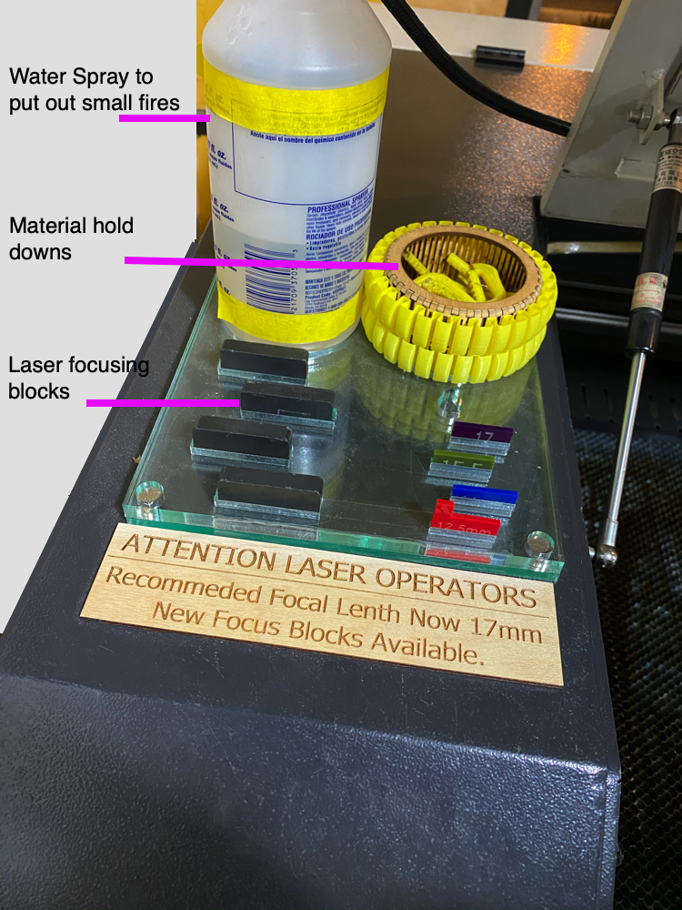
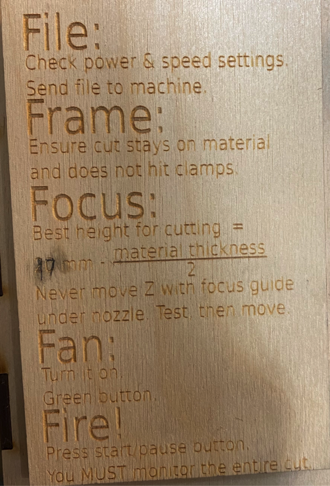
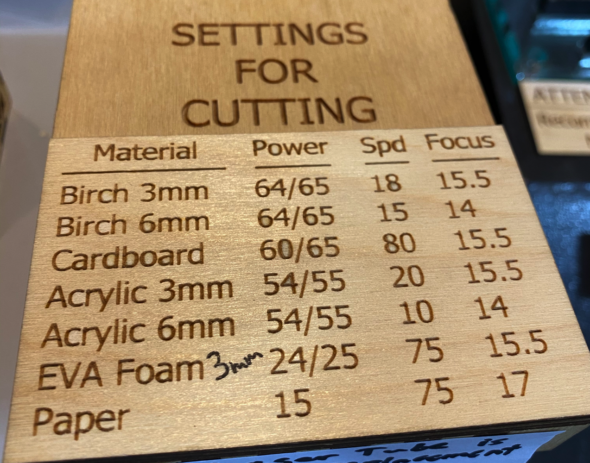
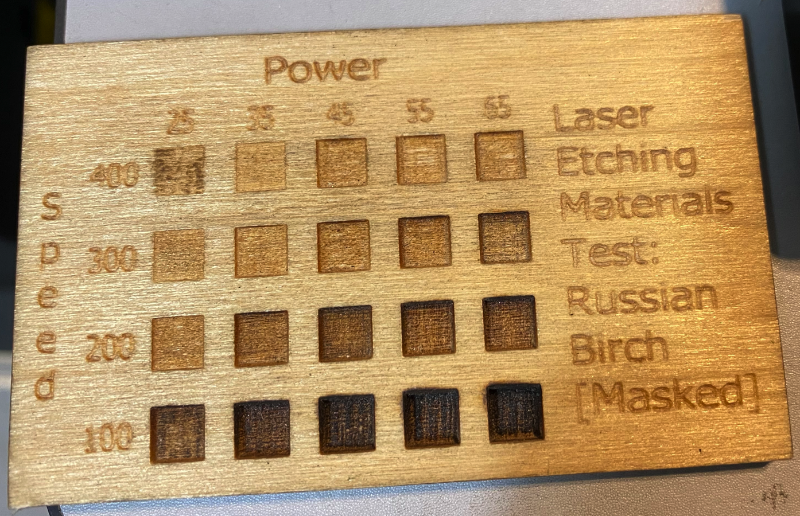
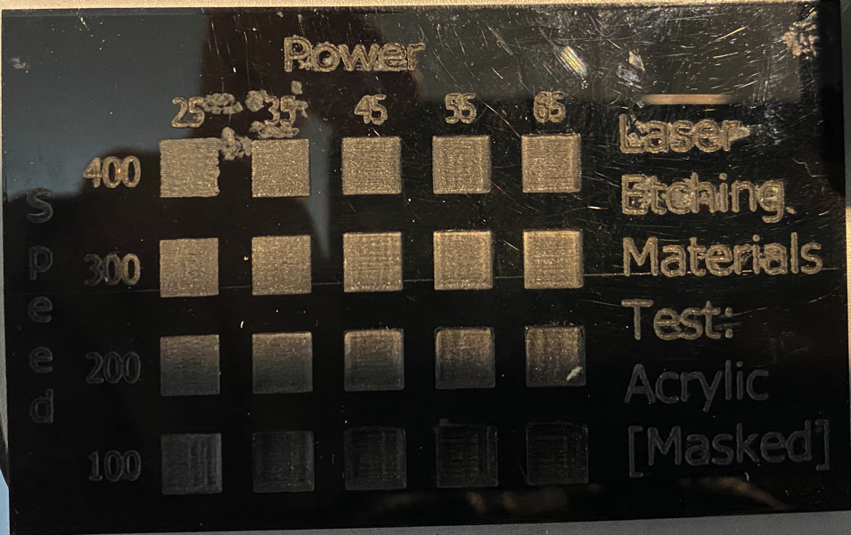
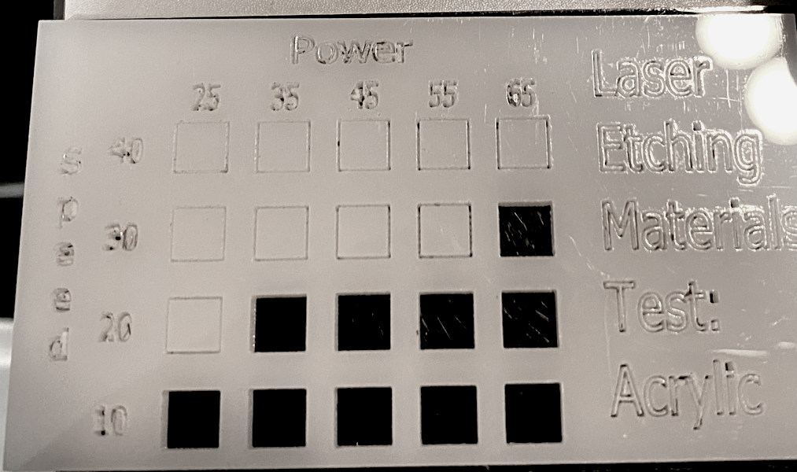

# Laser Cutter

Things you should know about the Laser Cutter.

## Make and Model
There are two [Black Cat Labs 90 Watt CO2 Lasers](https://www.blackcatlabs.xyz/laser-cutters) at Seattle Makers which have the Ruida controller. We use [Lightburn Software](https://lightburnsoftware.com/) to design and sends designs to the Ruida.

## Materials

- Max material size: 20.75″x33.75″ (53cm x 86cm)
- Max design size: 20.25″x33.25″ (52cm x 85cm)
- Max cut thickness: 1/4”
- Engraving Max material thickness: 8”

**[Materials For Sale at Seattle Makers](https://seattlemakers.org/store/items/supplies/)**

### Allowed Materials

- Cut: acrylic, wood, paper, leather, some plastics, some foams
- Engrave / Etch: the materials above plus glass, anodized aluminum
- [Full list of laserable materials](../static/files/Laser-cut-and-dont-cut-materials-list.pdf) (list courtesy of ATX Makerspace)

### Disallowed Materials
You may hurt yourself, the machine, our just ruin your materials.

- Can’t cut: polycarbonate, metal, glass, PVC, most plastics
- [Full list of non-laserable materials](../static/files/Laser-cut-and-dont-cut-materials-list.pdf) (list courtesy of ATX Makerspace)

## Usage Rules

1. You must have completed the [Laser Certification class](https://seattlemakers.org/catalog#lasercert).
1. Safety Procedures
    - Make note of the nearest fire extinguisher.
    - Small Fire: If your material starts burning, press pause and move the laser away from the area. It will usually go out on its own. Or use the water spray bottle sitting on the left side of the machine.
    You can then press resume to continue your cut.
    - Large Fire or other OMG situation.. hit the big red button.

## Pricing

Laser cutter time is charged in 15-minute increments.
[Buy Time](https://seattlemakers.org/store/time-laser/) or [Schedule Time](https://seattlemakers.org/schedule/#lasers) on Seattle Makers website.

## Designing and Cutting your project

A Laser uses 2D graphics files (as opposed to a 3D CAD file) as the information to control the machine. In the certification class you will learn to use LigthBurn to make a design. You can also use other software, as long as those programs can create SVG, DXG or AI files.

> Supported File types: .svg, .dxf, .ai files (Adobe Illustrator – but only files with ONE artboard)

You can design on the PCs at Seattle Makers or at home on your own computer. Assuming you design at home, once you're done, you will bring the file to the lab on a USB drive or email it to the lab.

### Step By Step Process

#### Machine Overview

The right side is where you'll do most of your machine setup setups on the Ruida.

#### Material Setup

1. You must use "masked" materials to get the highest quality output for your projects. The masking is a paper covering on the material which protects the material from smoke damage during the cutting process. This is true for woods and plastics.
1. Secure your material in the machine using the hold-downs supplied at Seattle Makers.

#### Machine Setup

1. Check the AC and the Heaters are off in the other room.
1. Turn on the laser printer by twisting the red STOP button so it is in the up position.
1. Open Lightburn on the on the Laser Cutter's PC and **Import** the file from your USB Drive.
    1. Check that your file looks as you expect.
    1. Set all of the Speed and Power settings for each layer. There are several sample materials for you to look at and help select settings.
1. Send the file to the Laser cutter.
1. Move the laser pointer (red dot) to the same corner as the green square in your drawing and press **Origin** to set this position as your origin.
1. Press the **Frame** button to ensure the outer dimensions of your cut will stay within the confines of your material.
1. Move the laser head to your material and adjust the Z Axis (also known as setting the laser focus). You press the **Z/U** button on the Ruida and **left\right** to move the bed up\down. Use the height blocks on the left of the laser cutter to ensure you have the appropriate Z height. The block should juts barely fit under and not be touching the laser.
1. Check for anything which should not be in the cutting area.
1. Close the lid.
1. Press the **Fan** button to start the fan.
1. Press **Start** and the laser will move back to the origin and begin cutting.
1. When your cut is complete:
    1. Leave the fan running a minute or two to be sure all smoke is removed from the cutting chamber.
    1. Open the lid and remove your work.
    1. If you're materials smells (acrylic, rubber, etc..) leave the fan running longer or set the materials outside so everyone doesn't have to breathe the fumes.

## Additional Resources
**Samples**
These samples are available in the the shop as well.
They help you decide on the SPEED and the POWER settings for your project.

> NOTE: Ocassionally the laser's CO2 is low and you need to adjust your setting. This will be clearly labeled on the laser cutter.

**How-To's Tips and Tricks**

- How close together can you put things?
- Gluing Acrylic

**Community**

 - Seattle Makers' Slack has a Laser-Cutter channel
- [Reddit Laser Cutter Community](https://www.reddit.com/r/lasercutting/)

 **Design Tools**

 - [LightBurn Software YouTube Channel](https://www.youtube.com/c/LightBurnSoftware/playlists) has tutorials and demos.
 - [Boxes.py](https://festi.info/boxes.py/) is an Online and Open Source box generator written in Python.
 - [MakeABox.io](https://makeabox.io/) is an Online front end to the [laser-cutter Ruby gem](https://github.com/kigster/laser-cutter)
 - [MakerCase](https://www.makercase.com) is a web-based application for designing boxes or project cases for laser cutters and CNC routers.
